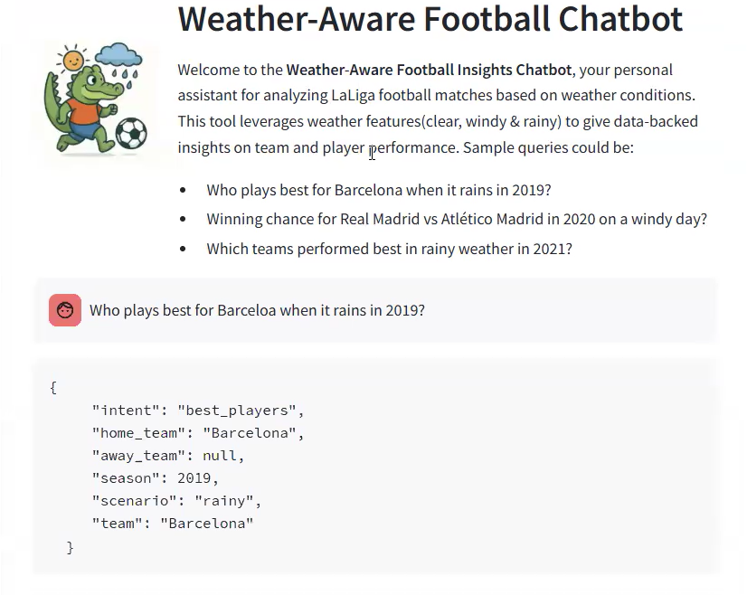
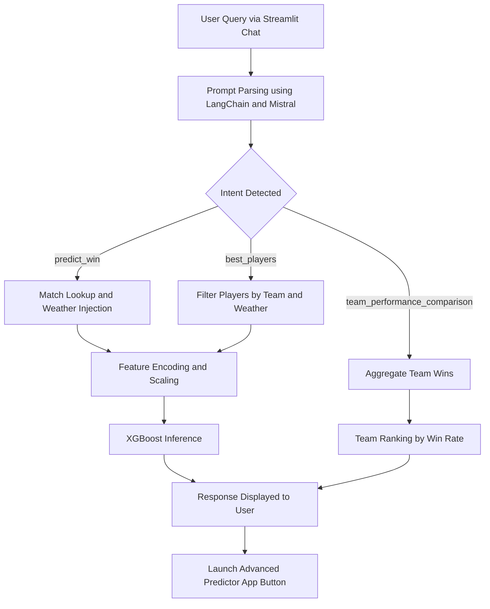
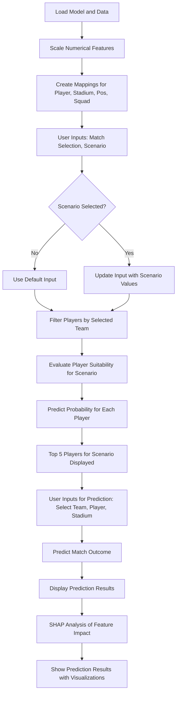
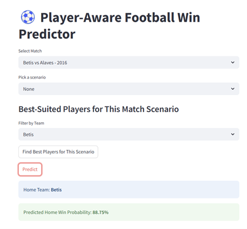

# cap5771sp25-project

<table>
  <tr>
    <td></td>
    <td>
      <h1>Weather-Aware Football Insights Chatbot</h1>
    </td>
  </tr>
</table>


---
## ⛈️Overview
Data has been used very extensively in the field of soccer. One prime example is the robust number of sport analysts in Liverpool who take key decisions for recruitment based on the data. I am a huge fan of soccer in general and heavily follow Spanish soccer (LaLiga). This project focuses on building an interactive Streamlit chatbot designed to analyze football matches and player performance under different weather conditions. Using an XGBoost classification model trained on match stats and player performance metrics, combined with natural language understanding via LangChain and Mistral(Ollama), the chatbot allows users to ask intuitive questions and receive smart, data-backed insights.

---
## 🧠What Does This Chatbot Do?
* Predict match outcomes with weather conditions as a key influence
* Identify best players suited to specific match conditions like rain, wind, or clear skies
* Compare team performance across weather-based scenarios
* Respond to natural language queries such as:
  * “Who plays best for Barcelona when it rains?”
  * “What’s the win chance for Real Madrid vs Atletico Madrid on a windy day?”
  * “Which teams won most matches when it rained in 2022?”
---
## 🛠️Chatbot demo

<p align="center">
  <a href="https://youtu.be/enPAKnECxnE">
    
  </a>
</p>
<p align="center">Clicking on the image above will take you to the demo video.</p>

---
## 📸Chatbot Interface



---
## 💻Setup Instructions
```
# 1. Clone the repo
git clone https://github.com/yourusername/FootballInsightsChatbot.git
cd FootballInsightsChatbot

# 2. Create and activate environment
python -m venv venv
source venv/bin/activate  # or `venv\Scripts\activate` on Windows

# 3. Install dependencies
pip install -r requirements.txt

# 4.Install Ollama and Mistral
Download and install Ollama from https://ollama.com/library/mistral:instruct
After installation, make sure to Start mistral in your terminal with:
ollama pull mistral:7b

# 4. Launch the chatbot
streamlit run chatbot_app.py

```

### Notes:
- Ensure you have **Python 3.7+** and **pip** installed on your machine.
- The `requirements.txt` includes all necessary dependencies like **Streamlit**, **Pandas**, **XGBoost**, **SHAP**, etc.
- After launching, the app should open in your browser for interaction.
---

## ⚙️How does the chatbot Works


---
## 🔍Example Chat Queries
You can interact with the chatbot using natural football questions like:
* “What is the win chance for Barcelona vs Real Madrid in 2022 on a rainy day?”
* “Which player from Atletico Madrid is best suited for windy conditions?”
* “Which teams had the highest win rate when it rained last season?”

---
## What Does This Advanced Predictor Do?
The **Advanced Predictor App** uses machine learning to predict the outcome of football matches and provide insights into player performance based on varying conditions. Below are the key features of the app:

- **Predict Match Outcomes**:
  - Uses an **XGBoost machine learning model** trained on historical football match data.
  - Predicts the probability of a **home win** based on player and team statistics, match conditions, and historical data.

- **Player Suitability Based on Match Scenario**:
  - Identifies the best-suited **players** for a given match scenario (e.g., weather conditions, home vs. away).
  - Select a **team** (home or away) to filter players and receive recommendations for the top-performing players.

- **Scenario-Based Predictions**:
  - Choose from predefined **scenarios** like:
    - **Clear day** (no weather disruptions),
    - **Rainy winter** (heavy rain),
    - **Windy derby** (high winds).
  - Adjusts the prediction based on the selected scenario, providing a more accurate outcome.

- **SHAP Analysis for Transparency**:
  - Provides **SHAP (SHapley Additive exPlanations)** analysis to explain the model’s decision-making.
  - Visualizes the importance of different features (e.g., player stats, weather) in influencing the prediction.

- **Visual Results**:
  - Displays the **predicted home win probability** for the selected match.
  - Shows the **top 5 players** best suited for the selected scenario.
  - **SHAP summary plot** to visually demonstrate feature importance.

- **Interactive User Interface**:
  - Built with **Streamlit**, allowing users to:
    - Select a **match**, **team**, and **scenario**.
    - View instant predictions, player suggestions, and feature impact all in an easy-to-read format.

---

## ⚙️How does the advanced predictor app Works



---

## 📸 Advanced Predictor Interface



---

## 🎯 Future Enhancements

- Add player-level SHAP visualizations in chat
- Integrate weather forecast API for upcoming matches
- Expand support to other leagues (e.g., EPL, Bundesliga)
- Improve LLM prompt reliability with RAG integration
---

## 🔧Tech Stack

| Tool              | Usage                                    |
|-------------------|-------------------------------------------|
| `XGBoost`         | Predictive model for match outcomes       |
| `Streamlit`       | Web interface for chatbot and UI          |
| `LangChain`       | Prompt processing and chain management    |
| `Mistral (local)`| LLM used for natural language understanding |
| `Pandas` / `NumPy`| Data manipulation and preprocessing       |
| `Matplotlib`      | SHAP explanation plots                    |

---

## 🙌 Acknowledgements

- Built as part of **CAP5771 (Spring 2025)** @ **University of Florida**
- Special thanks to **Dr. Laura Cruz Castro** for her invaluable support, encouragement, and guidance throughout the project.
- Inspired and powered by the open-source ecosystem:
  - [LangChain](https://www.langchain.com/)
  - [Ollama](https://ollama.ai/)
  - [Mistral](https://ollama.com/library/mistral)
  - [Streamlit](https://streamlit.io/)
  - [XGBoost](https://xgboost.readthedocs.io/)
